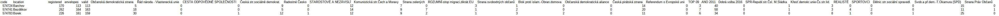

# Elections Scraper

## Popis
Tento projekt je zaměřen na scraping výsledků voleb z roku 2017 z webových stránek volby.cz. Skript stahuje výsledky hlasování pro konkrétní územní celek a ukládá je do CSV souboru.

## Instalace knihoven
Vytvořte virtuální prostředí a nainstalujte potřebné knihovny:
```bash
python -m venv election_scraper_env
source election_scraper_env/bin/activate
pip install -r requirements.txt

## Spuštění skriptu
Skript se spouští za pomoci dvou argumentů: 
1. odkaz, který územní celek chcete scrapovat (př. https://www.volby.cz/pls/ps2017nss/ps32?xjazyk=CZ&xkraj=12&xnumnuts=7103)
2. jméno výstupního souboru (př. vysledky_prostejov.csv)
Příkaz pak může vypadat takto: python main.py "https://www.volby.cz/pls/ps2017nss/ps32?xjazyk=CZ&xkraj=12&xnumnuts=7103" "vysledky_prostejov.csv"

## Výstupní CSV bude obsahovat:
- kód a název obce
- počet voličů, obálek, platných hlasů
- hlasy pro jednotlivé strany

## Ukázka výstupu 

